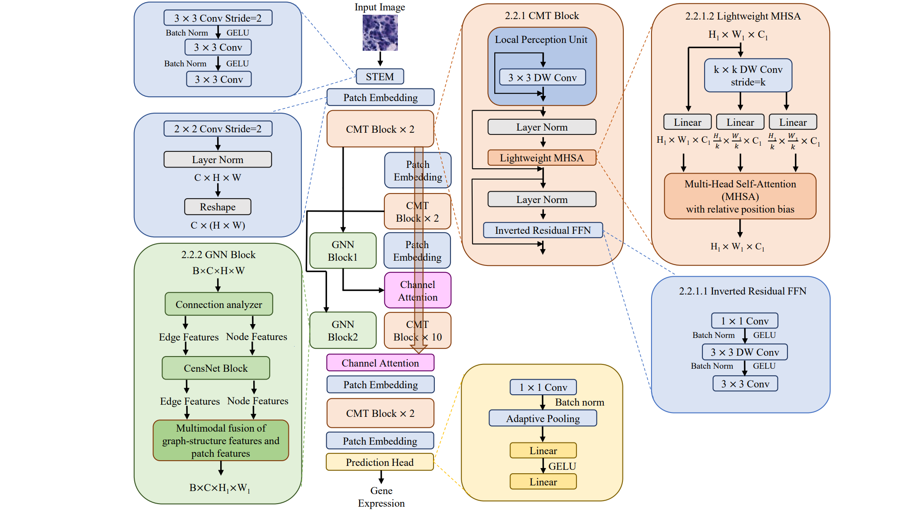
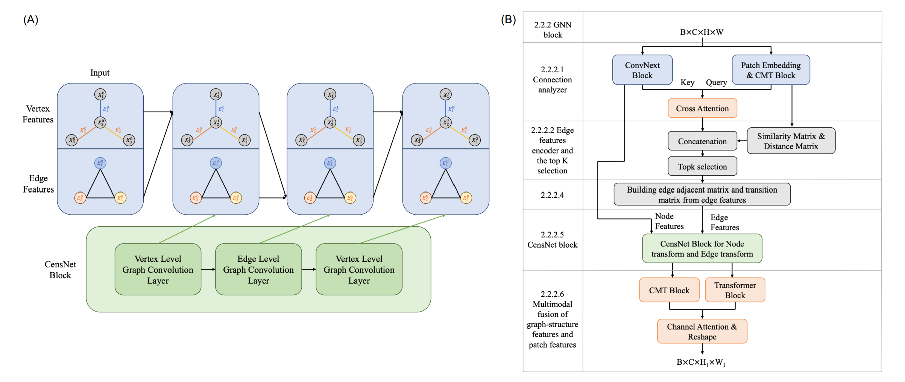

# Transformer with Convolution and Graph-Node co-embedding: A accurate and interpretable vision backbone for predicting gene expressions from local histopathological image

Xiao Xiao1,2,3, Yan Kong1,2, Ronghan Li1,2, Zuoheng Wang3, Hui Lu2,1,4,*

1State Key Laboratory of Microbial Metabolism, Joint International Research Laboratory of Metabolic and Developmental Sciences, Department of Bioinformatics and Biostatistics, School of Life Sciences and Biotechnology, Shanghai Jiao Tong University, Shanghai, China

2SJTU-Yale Joint Center for Biostatistics and Data Science, National Center for Translational Medicine, Shanghai Jiao Tong University, Shanghai, China

3Department of Biostatistics, Yale University, New Haven, CT, United States

4Center for Biomedical Informatics, Shanghai Children’s Hospital, Shanghai, China

*** Correspondence: 

** Hui Lu 
 [huilu@sjtu.edu.cn](mailto:huilu@sjtu.edu.cn)

**Keywords: deep learning, breast cancer, convolutional neural network, graph neural network, transformer, spatial transcriptomics.** 

 

**Highlights**

- First vision backbone to integrate CNN, GNN, and transformer for image analysis

- Higher gene expression prediction accuracy without global information

- Accurately predicted genes are related to immune escape and abnormal metabolism

- Predict important biomarkers for breast cancer accurately from cheaper images
- Can also be applied to bulk RNA-seq, different ST platform, different species






# Usage

As a general computer vision backbone, the TCGN model can be easily used.

```python
import torch
from model import TCGN

my_model=TCGN(num_classes=785)# predict 785 genes
# load pretrained model
my_model.load_state_dict(torch.load('./record-TCGN/A2-TCGN-her2-best.pth'), strict=True)
# use gpu to run the model
my_model = my_model.cuda()
# imgs: input batched image tensor on the gpu with shape Batch_size x 3 x 224 x 224
# if the input img with the same size as the spot in the spatial transcriptomics, then resize the img to 224 x 224
# img should be 0-1 normalized, then normalized by IMAGENET_DEFAULT_MEAN, IMAGENET_DEFAULT_STD in the python package timm
predictions=my_model(imgs)
# predictions: predicted gene expression tensor with shape Batch_size x 785
# where 785 is the number of genes the model is set to output
```

# System environment

Required package:

- PyTorch >= 1.10
- scanpy >= 1.8
- python >=3.7

# Datasets

- human HER2-positive breast tumor ST data https://github.com/almaan/her2st/.
- human cutaneous squamous cell carcinoma 10x Visium data: GSE144240 (https://www.ncbi.nlm.nih.gov/geo/query/acc.cgi?acc=GSE144240).


# Pipeline

1. Please run the script `download.sh` in the folder data
2. Run `gunzip *.gz` in the dir ``../data/her2st/data/ST-cnts/` to unzip the gz files
3. Run the following command to run the cross-validation on fold 0 (change the number 0 for other fold cross-validation):

```bash
python -u train.py --fold 0
```

